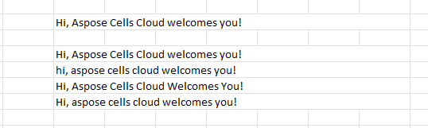

## **Change Word Case**

Use the Aspose.Cells Cloud Web API to instantly convert text case in your spreadsheet—switch between uppercase, lowercase, proper case (capitalize each word), or sentence case (capitalize the first letter of each sentence) across a selected range. Only string cells are affected; numbers, booleans, errors, and blanks are ignored. Formulas, formatting, and data validation remain untouched.

- **UpperCase** – every character capitalized.
- **LowerCase** – every character lower‑cased.
- **ProperCase** – first letter of each word upper‑cased, the remainder lower‑cased.
- **SentenceCase** – first letter of each sentence upper‑cased, the remainder lower‑cased.



### Web API

```http
PUT https://api.aspose.cloud/v4.0/cells/content/wordcase
```

### Request Parameters for **UpdateWordCase** API

| Parameter Name | Type   | Location | Description                                                                                                                                                           |
| :------------- | :----- | :------- | :-------------------------------------------------------------------------------------------------------------------------------------------------------------------- |
| spreadsheet    | File   | FormData | The spreadsheet file to be processed. Supported formats include XLSX, XLS, ODS, CSV, etc.                                                                             |
| wordCaseType   | String | Query    | Specifies the text‑case conversion type: `UpperCase`, `LowerCase`, `ProperCase`, or `SentenceCase`.                                                                   |
| worksheet      | String | Query    | _(Optional)_ The name of the worksheet where case conversion will be applied. If omitted, the operation applies to the first worksheet of the workbook.               |
| range          | String | Query    | _(Optional)_ The cell range where case conversion will be applied (e.g., `"A1:C10"`). If omitted, the operation applies to all used cells in the specified worksheet. |
| outPath        | String | Query    | _(Optional)_ The cloud storage folder path where the processed workbook will be saved. If omitted, the file is saved in the source folder.                            |
| outStorageName | String | Query    | The name of the cloud storage where the output file will be stored.                                                                                                   |
| region         | String | Query    | _(Optional)_ Sets the locale for text‑case conversion rules, particularly relevant for language‑specific capitalization (e.g., `"en-US"`, `"tr-TR"`).                 |
| password       | String | Query    | _(Optional)_ If the uploaded spreadsheet is password‑protected, provide the password to open and process the file.                                                    |

### Response

```json
[
  {
    "Name": "ResponseFile",
    "DataType": {
      "Identifier": "File",
      "Reference": "Stream"
    }
  }
]
```

### Error Codes

- **400 Bad Request** – Invalid Aspose.Cells Cloud API URI.
- **401 Unauthorized** – Invalid access token or incorrect client credentials.
- **404 Not Found** – The spreadsheet file is not accessible.
- **500 Server Error** – The spreadsheet encountered an internal processing anomaly.

## Where should we use the change word case API?

### Data Cleaning and Standardization

- **Customer Data Management** – Standardize the capitalization of customer names and address information (e.g., `john doe` → `John Doe`).
- **Product Catalog Processing** – Standardize product titles and description texts (e.g., `IPHONE 15 PRO` → `iPhone 15 Pro`).
- **Financial Report Generation** – Normalize item names and description fields in financial statements.

### Multi‑source Data Integration

- **Data Warehouse ETL** – Standardize text format when loading data from various systems.
- **API Data Reception** – Handle data with inconsistent capitalization returned by external APIs.
- **Cross‑department Data Merging** – Standardize text format in Excel reports from different departments.

### Content Management System

- **Automated News Releases** – Automatically format news headlines and content (capitalization rules for titles).
- **Product Documentation Generation** – Ensure consistency in the formatting of technical documentation terms.
- **Knowledge Base Maintenance** – Standardize the text format of FAQs and help documents.

### Enterprise Application Integration

- **CRM System Integration** – Automatically format names and company information during import/export of customer data.
- **ERP Data Processing** – Standardize key fields such as material descriptions and supplier names.
- **HR Management System** – Standardize employee information and job titles.

### Batch Document Processing

- **Legal Document Preparation** – Batch processing of clause formats in contracts and agreements.
- **Marketing Materials Generation** – Standardize text formats of advertising copy and email templates.
- **Academic Paper Formatting** – Standardize format requirements for references and titles.

### Real‑time Data Processing

- **User Input Validation** – Real‑time formatting of form data submitted by users.
- **Chatbot Responses** – Standardization of text format for automatically generated responses.
- **Instant Report Generation** – Dynamic creation of uniformly formatted business reports.

### Internationalization and Localization

- **Multilingual Data Processing** – Handle differences in capitalization rules for texts in various languages.
- **Localization Content Preparation** – Prepare formatted local content for different regions.
- **Translation Project Management** – Ensure consistency in text format before and after translation.

## Why should you use the change word case API?

- **Developer‑Friendly** – Aspose.Cells Cloud offers SDK libraries in multiple languages, enabling quick development and comprehensive documentation. Compared to building custom solutions, this significantly reduces development workload.
- **Cost‑Effective** – You can change word case without first uploading the workbook, which saves storage space and reduces costs.

## OpenAPI Specification

The [OpenAPI Specification](https://reference.aspose.cloud/cells/#/TextProcessingController/UpdateWordCase) defines a publicly accessible programming interface and lets you carry out REST interactions directly from a web browser.

### Use Aspose.Cells Cloud SDKs

Using the SDK is the best way to accelerate development. The SDK handles the underlying details, allowing you to simply implement **UpdateWordCase** for cells with minimal code. Please check out the [GitHub repository](https://github.com/aspose-cells-cloud) for a complete list of Aspose.Cells Cloud SDKs.

The following code examples illustrate how to make calls to Aspose.Cells web services using various SDKs:



























