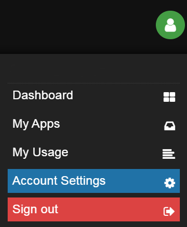
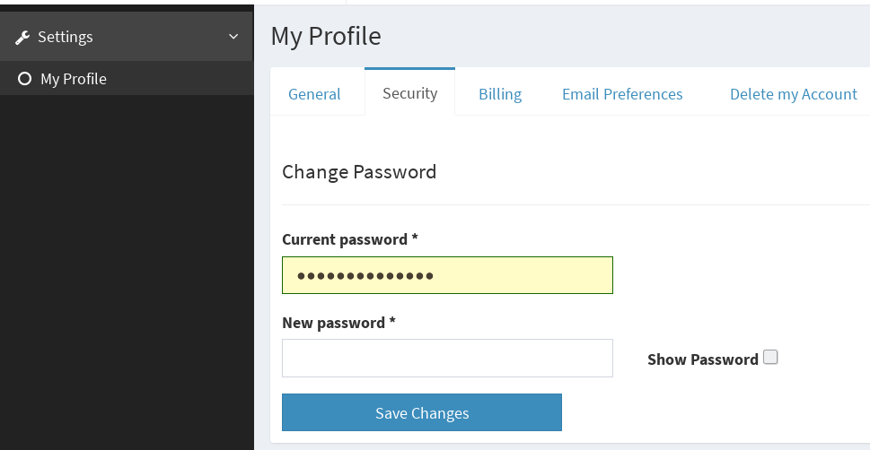
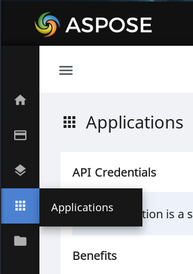
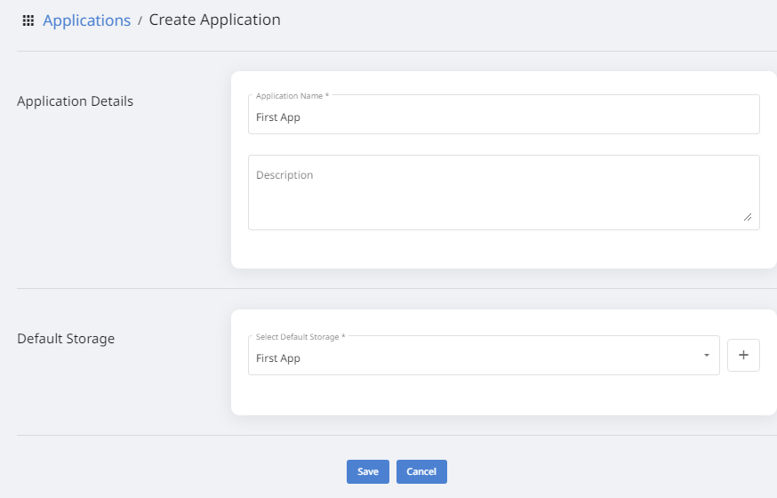
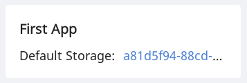

These instructions guide you through initializing Aspose.Cells Cloud API and installing the required spreadsheet-processing libraries.

You can easily integrate spreadsheet conversion, generation and editing features into applications running on any modern OS. They assist to read, edit, merge, split spreadsheets as well as convert spreadsheets to various file formats. These programming libraries allow you to work with a complete set of Spreadsheet components, such as data, styles, formulas, tables, chart, pivot table, headers, footers, comments, drawing objects, hyperlinks, watermarks, and much more.

## Create a Free Account

Aspose Cloud relies on a clear and comfortable sales model, that you can fully evaluate and test a product before committing to buying it.

First, you need to create a free account to have access to Cloud infrastructure:

- Please go to [Aspose Dashboard](https://dashboard.aspose.cloud/#/) login page
- For a faster login, click the **Sign In with GitHub** or **Sign In with Google** button
- Provide the required information

{}

Congratulations! You have successfully signed up with Aspose Cloud.

{}

## View and Update Your Account Details

Next, you need to make individual adjustments to your account:

- Access your [Aspose Account Settings](https://id.containerize.com/admin/) by clicking  the icon in the upper-right corner of the page.

- Select the **Account Settings** item from the menu bar. Check your settings and click the **Save Changes** button to confirm.

## Get Your Security Credentials (Client Id & Secret)

Aspose attaches great importance to security issues. We use the JWT token for the  authentication and end-to-end HTTPS encryption to secure all client-server interactions.

An Application is a set of unique API credentials — **Client Id** and **Client Secret**. You can use them to authenticate when calling our Cloud API. In most cases, you require just a single Application. In some advanced scenarios, you may want to register and use several Applications with separate **Client Id & Secret** credentials.

To access information about your Applications, please perform the following steps:

1. Log in to [Aspose Dashboard](https://dashboard.aspose.cloud/#/)
2. On the left side of the page click the [Applications](https://dashboard.aspose.cloud/applications) tab.

3. Scroll down to the bottom of the page, you can find a Create New Application button, click it to create it.

4. Enter the creation page, select and enter the name, description, and storage address you want to build, and click the save button to return to the previous page after successful creation.

5. Scroll down to the bottom of the page, you will see the Application information box you just created, click it to view and update your security credentials.

{}

Congratulations! You have successfully obtained your security credentials to authenticate Aspose.Cells API calls.

{}

## Choose and Install SDK

Please take a moment to familiarize yourself with a wide range of Aspose.Cells Cloud products for a better understanding of your possibilities. These software products are built around a high-performance [Cloud API](https://apireference.aspose.com/), available 24/7.

For the effective use of Cloud API, we provide a family of powerful [Cloud SDKs](https://products.aspose.cloud/cells/family) for almost all major operating systems (Windows, macOS, Linux, Android) and popular programming languages, including [Android](https://products.aspose.cloud/cells/android), [C#](https://products.aspose.cloud/cells/net), [Python](https://products.aspose.cloud/cells/python), [Golang](https://products.aspose.cloud/cells/go), [Java](https://products.aspose.cloud/cells/java), [Node.js](https://products.aspose.cloud/cells/nodejs), [Perl](https://products.aspose.cloud/cells/perl), [PHP](https://products.aspose.cloud/cells/php), [Ruby](https://products.aspose.cloud/cells/ruby), and [Swift](https://products.aspose.cloud/cells/swift).

 All of the above SDKs are hosted on [GitHub](https://github.com/aspose-cells-cloud/). Each repository contains a wide range of code examples to illustrate its usage.

## Check the Developer Documentation and Code Examples

Now your account is fully configured and the developer environment is installed. You can start writing code with the chosen SDK. Please refer to the [Developer Guide](https://docs.aspose.cloud/cells/developer-guide/) for information on using the Cloud API easily.

e.g. Convert a Workbook to other formats.





















































## Ask for Assistance, If Necessary

Feel free to describe your problems and ask questions on our [Cloud Forums](https://forum.aspose.cloud/c/cells/7). Aspose technical support team is ready to help you. Have a note that Aspose does not provide technical support over the phone. Phone support is available only for sales and purchase questions.
