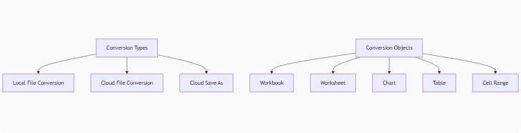
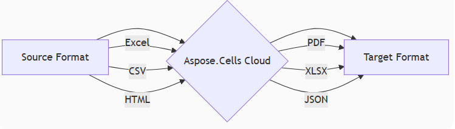

## Introduction

Aspose.Cells Cloud Spreadsheet API provides a set of dual-channel interfaces for converting local and cloud-based spreadsheet files. It supports formats such as Excel (XLS, XLSX), CSV, HTML, and PDF, making conversion effortless to meet various needs.

### Three Conversion Modes · Unified Object Model · Full Format Coverage



## **Core Conversion Matrix**

| Conversion Type       | Object Level      | Typical API                     | Output Formats                 |
|-----------------------|-------------------|---------------------------------|--------------------------------|
| **Local Conversion**  | Workbook          | `ConvertSpreadsheet`            | PDF/XLSX/JSON/.... 30+ formats |
|                       | Worksheet         | `ConvertWorksheetToImage`       | PNG/JPEG/SVG                   |
|                       |                   | `ConvertWorksheetToPdf`         | Pdf                            |
|                       | Table             | `ConvertTableToImage`           | PNG/JPEG/SVG/....              |
|                       |                   | `ConvertTableToPdf`             | Pdf                            |
|                       |                   | `ConvertTableToCsv`             | Csv                            |
|                       |                   | `ConvertTableToHtml`            | Html                           |
|                       |                   | `ConvertTableToJson`            | Html                           |
|                       | Range             | `ConvertRangeToImage`           | PNG/JPEG/SVG/....              |
|                       |                   | `ConvertRangeToPdf`             | Pdf                            |
|                       |                   | `ConvertRangeToCsv`             | Csv                            |
|                       |                   | `ConvertRangeToHtml`            | Html                           |
|                       |                   | `ConvertRangeToJson`            | JSON                           |
|                       | Chart             | `ConvertChartToImage`           | PNG/JPEG/SVG/....              |
|                       |                   | `ConvertChartToPdf`             | PDF                            |
| **Cloud Conversion**  | Workbook          | `ExportSpreadsheetAsFormat`     | PDF/XLSX/JSON/.... 30+ formats |
|                       | Worksheet         | `ExportWorksheetAsFormat`       | PDF/XLSX/JSON/.... 30+ formats |
|                       | Table             | `ExportTableAsFormat`           | PDF/XLSX/JSON/.... 30+ formats |
|                       | Range             | `ExportRangeAsFormat`           | PDF/XLSX/JSON/.... 30+ formats |
|                       | Chart             | `ExportChartAsFormat`           | PDF/XLSX/JSON/.... 30+ formats |
| **Cloud Save As**     | Workbook          | `SaveSpreadsheetAs`             | PDF/XLSX/JSON/.... 30+ formats |

### **Local File Conversion**

```csharp
// Get Cells Cloud API client
CellsApi cellsApi = new CellsApi(Environment.GetEnvironmentVariable("ProductClientId"), Environment.GetEnvironmentVariable("ProductClientSecret"));
```

- **Excel File Conversion**

```c#
// Convert local Excel to PDF
cellsApi.ConvertSpreadsheet(new ConvertSpreadsheetRequest { Spreadsheet = "EmployeeSalesSummary.xlsx", format = "pdf" }, "EmployeeSalesSummary.pdf");
```

- **Convert Excel Chart to SVG file**

```c#
// Convert local Excel Chart to Svg
cellsApi.ConvertChartToImage(new SDK.Request.ConvertChartToImageRequest
{
    Spreadsheet = "EmployeeSalesSummary.xlsx",
    worksheet = "Sales",
    chartIndex = 0,
    format = "svg"
}, "EmployeeSalesSummary.svg");

```

- **Convert Table to CSV file**

```C#
# Convert the sale logs table of the Sales worksheet to csv
result = api.ConvertTableToCsv( new SDK.Request.ConvertTableToCsvRequest
{
    Spreadsheet = "EmployeeSalesSummary.xlsx",
    worksheet = "Sales",
    tableName = "SaleLogs",
    format = "csv"
}, "EmployeeSalesLog.csv");

```

### **Cloud File Conversion**

Also need to obtain the Aspose Cells Cloud API client.

```csharp
// Get Cells Cloud API client
CellsApi cellsApi = new CellsApi(Environment.GetEnvironmentVariable("ProductClientId"), Environment.GetEnvironmentVariable("ProductClientSecret"));
```

- **Convert Excel to PDF**

```csharp
// Convert cloud Excel to PDF, Save to local file
cellsApi.ExportSpreadsheetAsFormat( new SDK.Request.ExportSpreadsheetAsFormatRequest 
{ 
    name = "EmployeeSalesSummary.xlsx" ,
    format = "pdf",
    folder ="NetSDKData" 
} , "EmployeeSalesSummary.pdf");   
```

- **Convert Excel worksheet to pdf**

```csharp
// Convert cloud Excel worksheet to PDF, Save to local file
cellsApi.ExportWorksheetAsFormat (new SDK.Request.ExportWorksheetAsFormatRequest 
{ 
    name = "EmployeeSalesSummary.xlsx",
    worksheet = "Sales",
    format = "pdf",
    folder ="NetSDKData" 
} , "EmployeeSalesSummary_Sales.pdf");   
```

```csharp
// Convert cloud Excel worksheet to PDF, Save to local file
cellsApi.ExportWorksheetAsFormat (new SDK.Request.ExportWorksheetAsFormatRequest 
{ 
    name = "EmployeeSalesSummary.xlsx",
    worksheet = "Sales",
    format = "pdf",
    folder ="NetSDKData" 
} , "EmployeeSalesSummary_Sales.pdf");   
```

## Installing and Initializing the Aspose.Cells Cloud SDK

Install the Aspose.Cells-Cloud NuGet package in your .NET project, you can use the NuGet Package Manager Console or the NuGet Package Manager in Visual Studio.
Here's how you can install the package using the Package Manager Console:

```Powershell

Install-Package Aspose.Cells-Cloud

```

Creates a new instance of the CellsApi class, initializing it with your client ID and client secret. Below are the details of the aforementioned code snippet:

```CSharp

CellsApi cellsInstance = new CellsApi(clientID, clientSecret);

```

Make sure to replace YOUR_API_KEY, YOUR_APP_SID, and YOUR_APP_KEY with your actual API key, application SID, and application key.

## **File Format Conversion Use Cases**  

Aspose Cells Cloud API delivers enterprise-grade **spreadsheet conversion** capabilities for critical business scenarios:  

1. **Excel → PDF**  
   Generate print-ready reports with preserved formatting  
2. **Spreadsheets → HTML**  
   Embed interactive tables in web applications  
3. **CSV → Excel (XLSX)**  
   Transform raw data into analyzable workbooks  
4. **Custom Format Transcoding**  
   Convert between 20+ formats (XLS, XLSB, ODS, FODS, TSV)  


## **Conclusion: Streamline Conversions with One API Call**  
